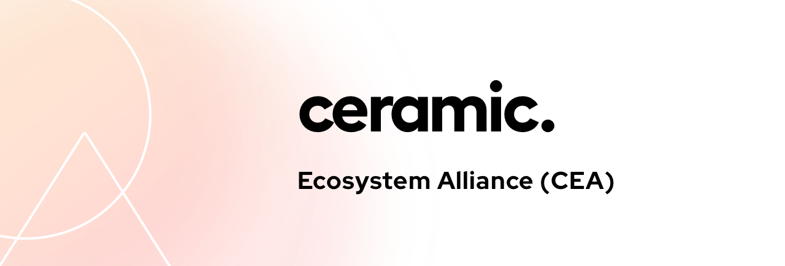

# Ceramic Ecosystem Alliance (CEA)

> The CEA is a collection of working groups for important Ceramic-related topics. CEA working groups often deliver CIPs.

- [Purpose](#purpose)
- [Structure](#structure)
- [Meetings](#meetings)
- [Working Groups](#working-groups)
- [Members](#members)
- [Join](#join-the-cea)

## Purpose

The CEA ***IS*** a grassroots network of Ceramic collaborators. It was created as a way for community members to self-organize into working groups to collaboratively discuss important topics related to Ceramic (such as governance, standards, use cases). To join, [follow these steps](#join-the-cea).

The CEA ***IS NOT*** a replacement for [Ceramic Core Calls](https://calendar.google.com/calendar/b/3?cid=Y2VyYW1pYy5uZXR3b3JrX3JsNzFrcXZtNzE4ZGY4aWk2cDZzanNmbDdjQGdyb3VwLmNhbGVuZGFyLmdvb2dsZS5jb20), including Core Community Calls where the broader community convenes to learn more about Ceramic, and Core Devs Calls where Ceramic developers discuss network upgrades. The CEA also is not a replacement for [CIPs](http://github.com/ceramicnetwork/cip) the process by which the community formally proposes standards or improvements to Ceramic.  Rather, the CEA serves as a focused vehicle for interested parties to zoom in on important issues, organize into topic-based working groups, and share outcomes amongst the group. A working group will often produce one or more CIPs.

## Structure

The CEA has three levels of participant structure:

| Role                            | Description            |
| :-------------                  | :-----------              |
| Members            | All participants. Expected to participate in working groups. |
| Working Groups            | Collections of members tackling specific areas of interest, such as Ceramic governance or identity. |
| Stewards                    | Members that run CEA meetings (not working group meetings) and ensure overall integrity of process. |

## Meetings

### CEA Meetings

The entire CEA gathers every six weeks for a meeting (attendance is optional). In this meeting, members:

- Share progress from existing working groups
- Propose the creation of new working groups

> Since CEA meetings are primarily built around sharing progress from working groups, at least 1 member from each active working group is expected to attend.

### Working Group Meetings

CEA members self-organize into topic-based working groups. Individual working groups create their own charter, decide their own meeting schedule, and communicate in their own designated channel in the Ceramic discord server. Typically, working groups meet frequently enough to share out at the next CEA meeting (currently every 6 weeks). Use the CEA [meetings notes template](templates/meeting-notes-template.md) to take good meeting notes to keep the rest of the CEA aligned.

## Working Groups

### List of working groups

| Working Group                   | Status                    | Description |
| :-------------                  | :-----------              | :---------- |
| `Ceramic Governance`            | Active                    | See [charter](working-groups/ceramic-governance/charter.md). |
| `Identity`                      | Active                    | See [charter](working-groups/identity/charter.md). |

Two working groups will kick off soon: Multichain and Data Interoperability. 

### How to form a new working group

1. [Join the CEA](#join-the-cea).
2. Create a [charter](templates/charter-template.md) for your working group.
3. Submit a Pull Request to the CEA repository adding your working group and charter. (See [here](working-groups) for examples.)
4. Propose your working group at the next CEA meeting. If approved, your PR will be merged, you will get a designated channel in the Ceramic discord, and your working group meeting schedule (specified in the charter) will be added to the CEA calendar.
5. Recruit participants for your working group.

## Members

Below, find a list of all members and their organizations.

| Organizations                     | Members        |
| :-------------                    | :-----------   |
| [3Box](http://3box.io)            | Michael Sena ([@michaelsena](http://github.com/michaelsena)), Joel Thorstensson ([@oed](http://github.com/oed)), Daniel Zuckerman ([@dazuck](http://github.com/dazuck)), Janko Simonovic |
| [Textile](http://textile.io)      | Carson Farmer, Andrew Hill |
| [IPFS](http://ipfs.io)            | Molly Mackinlay, Juan Benet |
| [Sia](https://sia.tech/)          | Mansai Vora |
| [Storj](https://storj.io/)        | Kevin Leffew |
| [Dappkit](https://www.dappkit.io/) | Vasa |
| [OrbitDB](https://orbitdb.org/)   | Mark Henderson [@aphelionz](https://github.com/aphelionz) |
| [Aragon](http://aragon.org)       | Burrrata, Aaron Foster |
| [Gitcoin](http://gitcoin.com)     | Kevin Owocki ([@owocki](http://github.com/owocki)) |
| [MetaMask](http://metamask.io)    | Erik Marks ([@remkarks](http://github.com/rekmarks)), Dan Finlay |
| [Magic](http://magic.link)        | Sean Li |
| [Temporal/RTrade](https://temporal.cloud/) | Derrick Foote |
| [Infura](http://infura.io)        | E.G. Galano |
| [Colony](http://colony.io)        | Auryn Macmillan |
| [Flow](https://www.onflow.org/)   | James |
| [Arweave](http://arweave.org)     | Jesper, Aidan |
| [The Graph](http://thegraph.com)  | Yaniv Tal, Brandon Ramirez |
| [RabbitHole](https://rabbithole.on.fleek.co/#/) | Brian Flynn |
| [BrightID](http://brightid.org)   | Adam Stallard |
| [Akasha](https://akasha.org/)     | Philip Sheldrake |
| [Lunie](https://lunie.io/)        | James Moreau |
| [Rainbow](https://rainbow.me/)    | Mike Demarais, Bruno |
| [Alchemy](http://alchemyapi.io)   | Nikhil Chari |
| [MetaCartel](https://www.metacartel.org/) | Peter Pan |
| [SimpleID](https://www.simpleid.xyz/) | Justin Hunter |
| [Connext](https://connext.network/) | Arjun Bhuptani |
| [Consensys](https://consensys.net/) | Thomas Rush, Mike Kriak
| [Fleek](https://fleek.co/)        | Brett, Harrison Hines, Janison |
| [Abridged](https://www.abridged.io/) | James Duncan, James Young |
| [WalletConnect](https://walletconnect.org/) | Pedro Gomes ([@pedrouid](http://github.com/pedrouid)) |
| [Gnosis](https://gnosis.io/) | Stefan |
| [Torus](https://tor.us/) | Zhen |
| [OST](https://ost.com/) | Benjamin Bollen |
| [Chainlink](https://ost.com/) | Andrew Thurman |
| [IXO](https://ixo.world) | Shaun Conway |
| [DAOstack](https://daostack.io/) | Ezra Weller |
| [Liminal Village](https://liminalvillage.com) | Josh Fairhead |
| [Beem](http://www.watchbeem.com/) | Cyprien Grau |
| [Userbase](https://userbase.com/) | Justin Berman |

### Stewards

- Michael Sena ([@michaelsena](http://github.com/michaelsena))
- Joel Torstensson ([@oed](http://github.com/oed))
- Danny Zuckerman ([@dazuck](http://github.com/dazuck))

## Join the CEA

1. Fill out [this 30 second form](https://danny765911.typeform.com/to/AAFtVN). 

2. Submit a Pull Request to this repository adding yourself to the members table above.

Once a steward has confirmed you have completed the previous two steps, they will merge your PR and send you a welcome email containing your invitations to the **CEA Call Calendar** and **Discord**.
